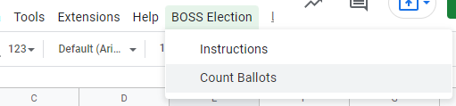
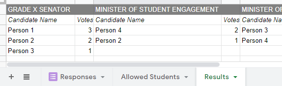

# `BOSS Electronic Voting System`
This script was written for Thornhill Secondary School to filter and count votes for the Board of Student Senator elections. The following instructions are specific to Thornhill Secondary School, and may not be applicable for all use.

***Before following these instructions (if applicable), make a copy of the Google Sheet. Copy the newly made form & sheet into another folder, then open the new sheet and follow these instructions***

## `1.1 - Operating Instructions`
1. Edit the attached Google Form to include the senator/executive positions. Make sure to enclose the position name in quotation marks. For example: _Vote for up to two candidates for "GRADE 11 SENATOR"_
   
2. To allow certain students to vote, paste in their GAPPS student ID (not including the email address, just the number) in the “Student No.” column of the "Allowed Students" tab.
   
3. The form is now ready and should be tested before use. Follow the testing procedure outlined in *2.1*.
4. Once the responses/ballots have been recorded, press the "Count Ballots" button under "BOSS Election" in the toolbar. It may ask you to authorize, click accept. **Make sure the script is only able to access the current spreadsheet, otherwise it is a sign that the script has been tampered with, and you should not use it.**

5. The results should be recorded in a new tab called "Results".

## `2.1 - Testing`

_Why is testing necessary?_

Testing should be completed before any election to ensure that no part of the script has been broken or changed. Some sources of error could be people editing the script, or due to changes made by Google in their systems. **Make sure to test the system thoroughly before use.**

### 2.2 - Testing Procedure
1. Make sure the final form is ready before testing, follow the steps in section *1.1*. This is to ensure that no error is introduced while editing/modifying.
2. Make a copy of the Sheet and Form and prefix it with "[Testing]". This is to avoid confusion.
3. Share the copied sheet with a few testers, and ask them to select random choices for each candidate. Make sure to include their student numbers in the "Allowed Students" tab.
4. Click the "Count Ballots" button, and make sure the results are as expected.

## `3.1 Setting Up`

This section is to guarantee the reproducibility of this system. **In normal circumstances, this should not be required.** But in cases of upgrading/fixing bugs, these instructions can come in handy.

### 3.2 Tools Required
To successfully set up this project, these tools are required:
- Node.js (https://nodejs.org/en/download/)
- clasp by Google (https://github.com/google/clasp)
- (optional, but recommended) Visual Studio Code (https://code.visualstudio.com/)
- (optional) git-cli (https://git-scm.com/downloads)

### 3.3 Steps

Follow these steps to set up the election software.
1. Download and install Node.js
2. Install clasp with the command `npm install -g @google/clasp`
3. Clone or Download this repository into a folder
4. In the folder, run `npm i -S @types/google-apps-script`
5. On the first time, you need to login to your Google account with the command `clasp login`
6. Run `clasp create <name>` and select `sheets` in the dropdown.
7. Open the sheets link shown in the console

8. In the sheets, create a linked form:

9. On the bottom, rename the linked form to `Responses` and create a new tab called `Allowed Students`. These must be exact for the script to work properly.

10. The script is now ready, you can update `sheets.ts` which is the main file, and compile/upload it with the command `clasp push`
11. Follow the instructions in *1.1* to operate the election.